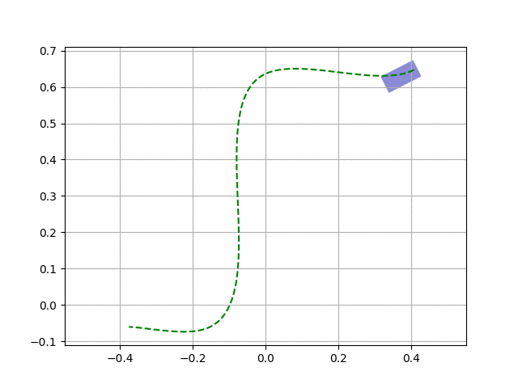

This directory contains a simple script (`vehicle-on-path.py`) to visualize the movement of a vehicle (rectangle) along a given path.

The path can be adapted via [pysplineform](https://github.com/cknoll/pysplineform).
